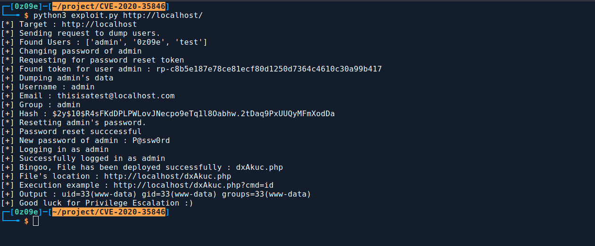
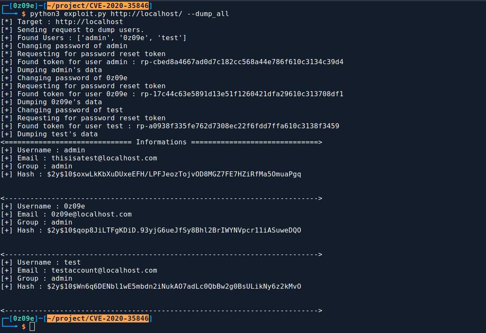

# Cockpit CMS NoSQL Injection to Remote Code Execution : CVE-2020-35846  
***
## Description
Cockpit CMS has some NoSQL Vulnerabilities which can be used to dump users' information, This information disclosures can be chained together to change users' passwords and which leads to `Remote Code Execution` on the Server.  
A brief description of all these vulnerabilities can be found [here](https://swarm.ptsecurity.com/rce-cockpit-cms/).  
## Usage   
```bash
┌─[0z09e]─[~/project/CVE-2020-35846]
└──╼ $ python3 exploit.py --help
usage: exploit.py [-h] [--dump_all] URL

_________                __           .__  __    ___________________ ___________
\_   ___ \  ____   ____ |  | ________ |__|/  |_  \______   \_   ___ \_   _____/
/    \  \/ /  _ \_/ ___\|  |/ /\____ \|  \   __\  |       _/    \  \/ |    __)_ 
\     \___(  <_> )  \___|    < |  |_> >  ||  |    |    |   \     \____|        
 \______  /\____/ \___  >__|_ \|   __/|__||__|    |____|_  /\______  /_______  /
        \/            \/     \/|__|                      \/        \/        \/ 

        Cockpit CMS NoSQL Injection to Remote Code Execution : CVE-2020-35846
        POC written by : 0z09e (https://github.com/0z09e)

positional arguments:
  URL         Target URL. Example : http://10.20.30.40/path/to/cockpit

optional arguments:
  -h, --help  show this help message and exit
  --dump_all  Dump all the informations about each and every user.(No password will be changed and no shell will be deployed)
```
- `URL` - The target URL in which `Cockpit CMS` is running.  
- `--dump_all` - Dump all the informations about each users present on the `CMS`.  

## Example : 
Deploying a `PHP-WebShell` :  



Dumping users information :   



## Reference
- https://swarm.ptsecurity.com/rce-cockpit-cms
***


